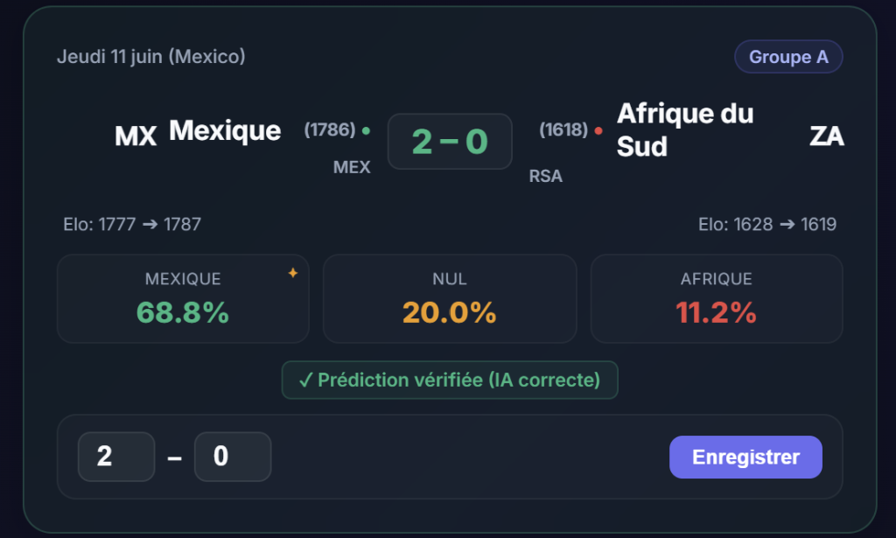

# FIFA World Cup 2026 Match Predictor ⚽🏆

An interactive, web-based Flask application to simulate and predict the outcomes of the FIFA World Cup 2026 matches. 

**Live Application**: [FIFA World Cup 2026 Predictor App](https://fifa-predictor-2026-lea-949231459570.europe-west1.run.app/)

## Predictor UI


## Data Sources (Kaggle)
The model was built and trained using the following Kaggle datasets:
- [International football results from 1872 to 2026](https://www.kaggle.com/datasets/martj42/international-football-results-from-1872-to-2017): Used to train the base model on over 10 years of historical international matches (9,500+ games).
- [WC2026 Match Probability Baseline Dataset](https://www.kaggle.com/datasets/sarazahran1/wc2026-match-probability-baseline-dataset): Used to load the official baseline Elo ratings for the 2026 World Cup teams.
- [FIFA World Cup 2026 Match Data (Unofficial)](https://www.kaggle.com/datasets/areezvisram12/fifa-world-cup-2026-match-data-unofficial): Used to construct the official World Cup group matches schedule and bracket.
- [FIFA World Cup 2026 Player Performance Dataset](https://www.kaggle.com/datasets/rauffauzanrambe/fifa-world-cup-2026-player-performance-dataset): Loaded and aggregated (Top 11 players per team) during model development, although the final prediction features prioritize Elo ratings, travel factors, rest days, and tournament form to avoid overfitting and ensure maximum prediction stability.

## Core Features
- **AI-Powered Match Predictions**: Native XGBoost model trained on historical data.
- **Chronological Elo Rating Updates**: Team Elos are updated in real-time as match scores are entered and dynamically propagate to affect predictions for all subsequent matches.
- **Form & Rest Days**: Dynamically calculates days of rest and tournament form factors for each match.
- **Dynamic Knockout Bracket**: Automatically computes group stage standings and propagates qualifiers (including the 8 best third-placed teams via bipartite matching) to the Round of 32 and beyond.

## Project Structure
- `app.py`: Main Flask application that serves the frontend, handles real-time Elo recalculations, and serves live predictions.
- `train_model.py`: Offline training script for the base XGBoost model.
- `Dockerfile`: Configuration file to containerize and deploy the app.
- `templates/index.html`: Responsive, modern dashboard UI.
- `data/`: Local storage for JSON/CSV match schedules, Elo baselines, and recorded scores.

## Installation & Running

### Using Docker
1. Build the Docker image:
```bash
docker build -t fifa-world-cup-predictor .
```
2. Run the container:
```bash
docker run -p 5000:5000 fifa-world-cup-predictor
```

### Local Development (Python)
1. Install dependencies:
```bash
pip install -r requirements.txt
```
2. Run the application:
```bash
python app.py
```
Open `http://127.0.0.1:5000` in your web browser.
